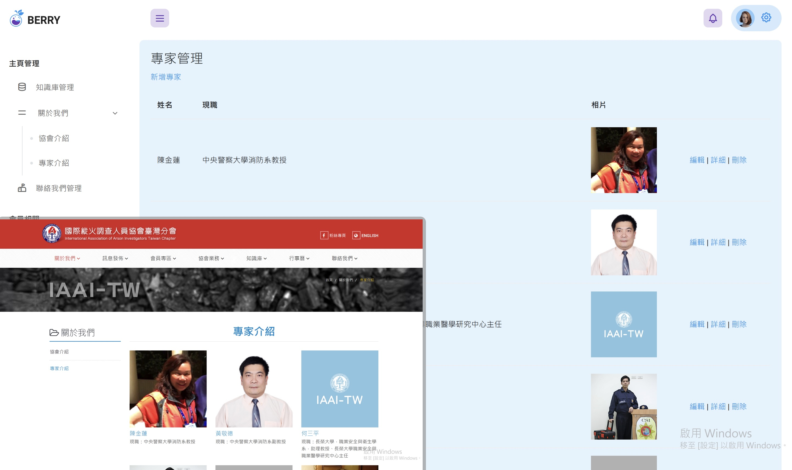
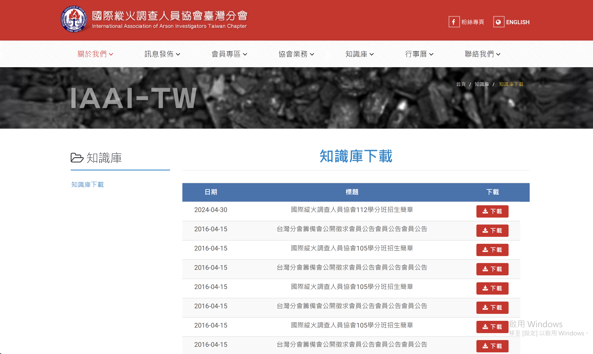
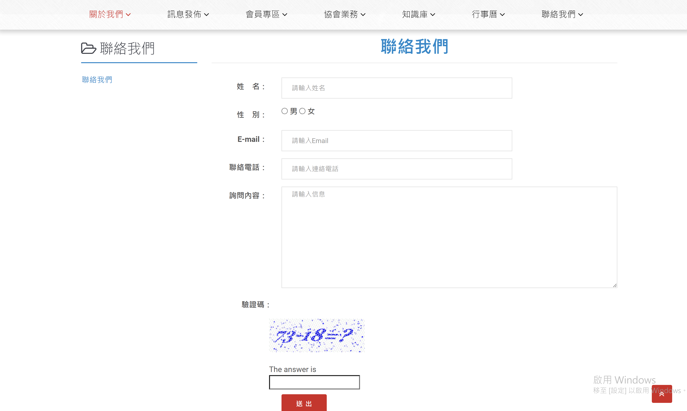

<h1 align="center">IAAI-TW ｜後台管理系統</h1>

 

---

【獨立專案】

IAAI-TW縱火平台專案主要負責後端以及後台系統開發，後台需具備完整CRUD及管理功能

【功能介紹】

**前端**：

* 知識庫：提供相關資訊下載
* 關於我們：提供專家呈現以及專家詳細資訊介紹
* 聯絡我：通過填寫表格的方式自動發送Mail(Google)，包含人機驗證(Captcha)

**後端**：

各前端頁面的CRUD功能，並在多筆資料時添加搜尋以及排列功能
管理專家/聯絡我們/知識庫管理

【心得回顧】

這是在培訓營學習WebForm的專案，發開約三週。
開發期間需要考量使用者體驗去建立合理使用的後台頁面，並同時要去思索資料表的建置，由於在這個專案中有大量使用到ADO.NET
內部使用參數化查尋進行資料填寫避免SQL injection狀況，對於網頁安全多了一份新的認知。

【使用技術】

* ASP.NET MVC：建立後台系統主要架構，具備完整CRUD功能
* MSSQL：建立資料庫及資料表關聯性
* Jquery：產生上傳檔案時預覽效果
* Bootstrap :套用並規劃後台版型

## 專案截圖：

＊ 專家介紹頁 ＆ 後台：

 

＊ 知識庫前台 ＆ 後台：

 

 

* 聯絡我們前台 ＆ 後台：

 

 

  ---
